# Instrukcja użytkowania — Literature Cart Install Manager

Niniejszy dokument opisuje krok po kroku, jak pobrać, zainstalować, skonfigurować i używać aplikacji desktopowej **Literature Cart Install Manager**. Aplikacja służy do instalowania, aktualizowania i usuwania skryptu Google Apps Script (GAS) w wybranych arkuszach Google Sheets.

---

## Spis treści

1. [Wymagania systemowe](#wymagania-systemowe)
2. [Jak pobrać aplikację](#jak-pobrać-aplikację)
3. [Uruchamianie instalatora Windows](#uruchamianie-instalatora-windows)
4. [Kreator pierwszej konfiguracji](#kreator-pierwszej-konfiguracji)
5. [Główne okno aplikacji](#główne-okno-aplikacji)
6. [Instalacja Apps Script w arkuszu](#instalacja-apps-script-w-arkuszu)
7. [Zarządzanie istniejącymi instalacjami](#zarządzanie-istniejącymi-instalacjami)
8. [Ustawienia](#ustawienia)
9. [O aplikacji](#o-aplikacji)
10. [Aktualizacja aplikacji](#aktualizacja-aplikacji)
11. [Całkowite odinstalowanie](#całkowite-odinstalowanie)
12. [Rozwiązywanie problemów](#rozwiązywanie-problemów)

---

## Wymagania systemowe

- System operacyjny: **Windows 10/11** (64-bit)
- Dostęp do Internetu
- Konto Google z dostępem do Google Drive / Google Sheets
- Wolne miejsce na dysku: około 250 MB (aplikacja + Node.js portable)

Aplikacja jest dostarczana jako instalator `Literature Cart Install Manager Setup.exe` przygotowany z użyciem `electron-builder` (NSIS).

---

## Jak pobrać aplikację

Najnowszą wersję instalatora możesz pobrać bezpośrednio z repozytorium artefaktów:

```text
https://github.com/literature-cart/literature-cart-artifactory/raw/refs/heads/main/literature-cart-install-manager/latest/Literature%20Cart%20Install%20Manager%20Setup.exe
```

Kliknij powyższy link w przeglądarce — plik `.exe` zostanie pobrany na dysk lokalny. Zalecamy zapisanie go w łatwo dostępnym miejscu, np. na Pulpicie lub w folderze `Pobrane`.

---

## Uruchamianie instalatora Windows

1. Otwórz folder z pobranym plikiem `Literature Cart Install Manager Setup.exe`.
2. Kliknij dwukrotnie plik instalatora.

### 1. Ostrzeżenie SmartScreen

Instalator nie jest podpisany cyfrowo, dlatego przy pierwszym uruchomieniu system Windows może wyświetlić czerwone okno **„System Windows ochronił ten komputer”** (filtr Microsoft Defender SmartScreen).

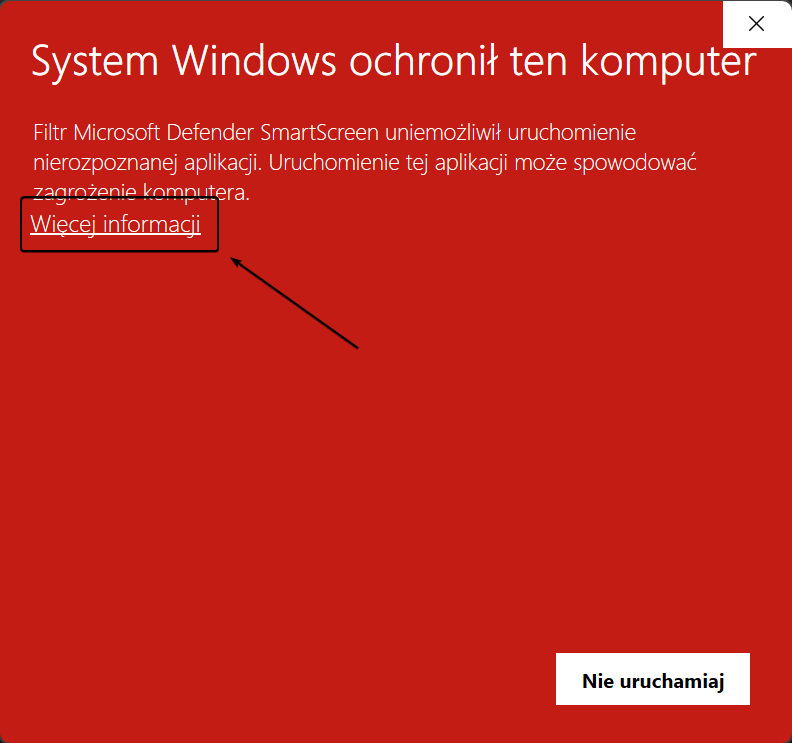

Kliknij **Więcej informacji**, aby odsłonić dodatkowe opcje.

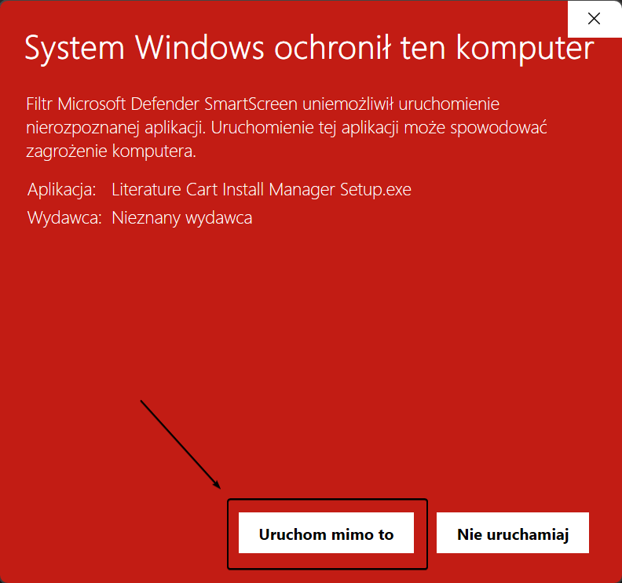

Kliknij **Uruchom mimo to** — instalator uruchomi się normalnie.

### 2. Kreator instalacji NSIS

Kreator instalacji poprowadzi Cię przez kolejne kroki. Interfejs kreatora jest w języku angielskim.

**Ekran powitalny** — kliknij **Next**, aby przejść dalej.

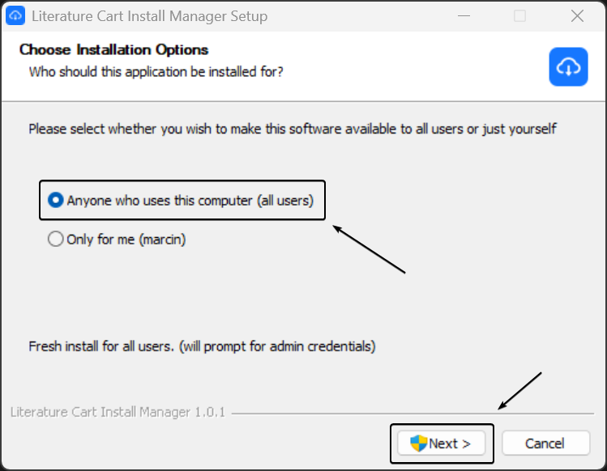

**Wybór folderu docelowego** — domyślnie aplikacja zostanie zainstalowana w `C:\Users\<użytkownik>\AppData\Local\literature-cart-install-manager`. Aby zmienić lokalizację, kliknij **Browse**, a następnie **Install**.

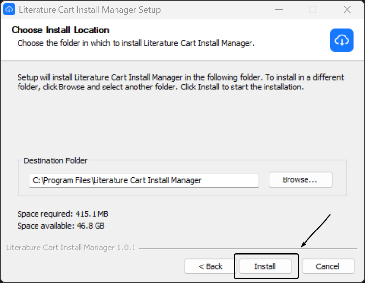

**Postęp instalacji** — poczekaj, aż pasek postępu dojdzie do końca.

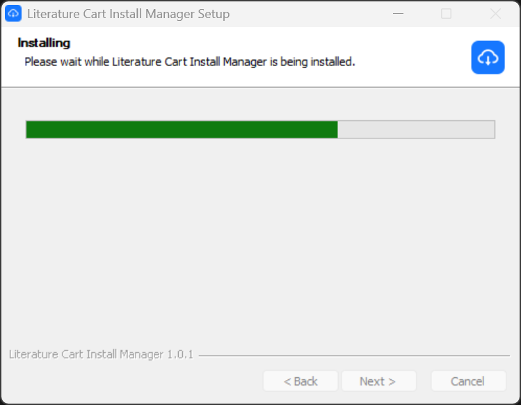

**Zakończenie instalacji** — zostaw zaznaczoną opcję **Run Literature Cart Install Manager** i kliknij **Finish**, aby od razu uruchomić aplikację.

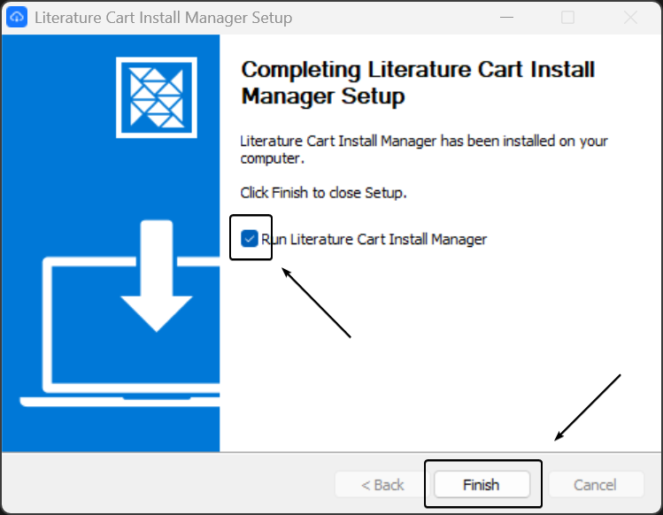

Instalator tworzy również wpis w rejestrze Windows, który umożliwia pełne odinstalowanie aplikacji przez **Panel sterowania → Programy i funkcje**.

---

## Kreator pierwszej konfiguracji

Po pierwszym uruchomieniu aplikacji wyświetli się **Kreator pierwszej konfiguracji**. Działa on tylko wtedy, gdy w profilu użytkownika brakuje pliku `app-settings.json`.

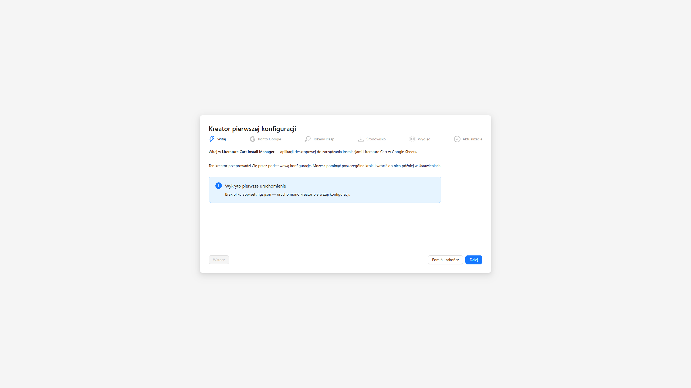

Kreator składa się z sześciu kroków:

### 1. Witaj

Ekran powitalny z krótkim opisem aplikacji i informacją o wykryciu pierwszego uruchomienia.

### 2. Konto Google

Kliknij **Zaloguj się do Google**, aby otworzyć wbudowany widok przeglądarki i zalogować się na swoje konto Google. Logowanie jest konieczne, aby aplikacja mogła pobierać pliki GAS i wykonywać operacje `clasp push`.

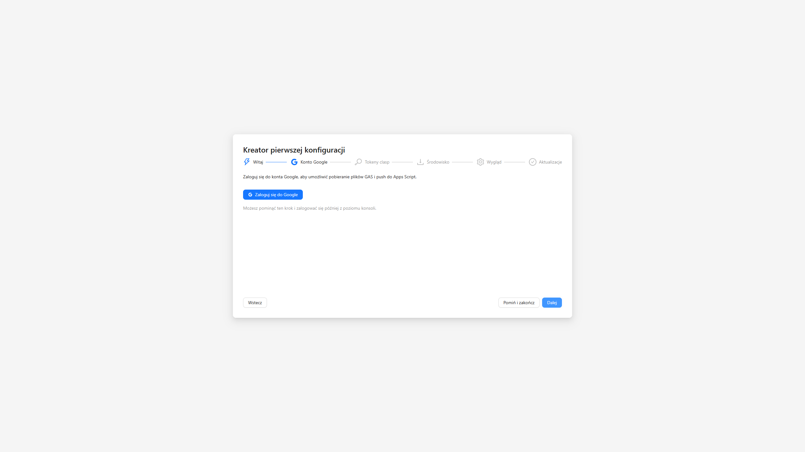

### 3. Tokeny clasp

Aplikacja automatycznie sprawdzi, czy tokeny OAuth dla narzędzia `clasp` zostały pobrane podczas logowania. Tokeny są przechowywane w bezpiecznym magazynie systemowym.

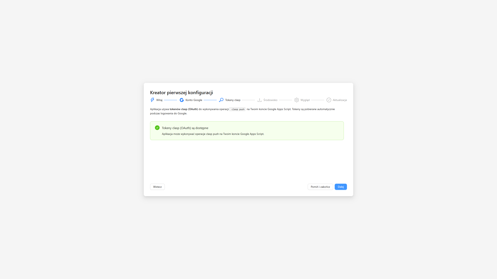

### 4. Środowisko Node.js

Aplikacja potrzebuje Node.js do stabilnego wykonywania operacji `clasp push`. Jeśli nie wykryje systemowej wersji Node.js, pobierze i wypakuje własną wersję portable. Kliknij **Pobierz Node.js**, jeśli przycisk jest aktywny.

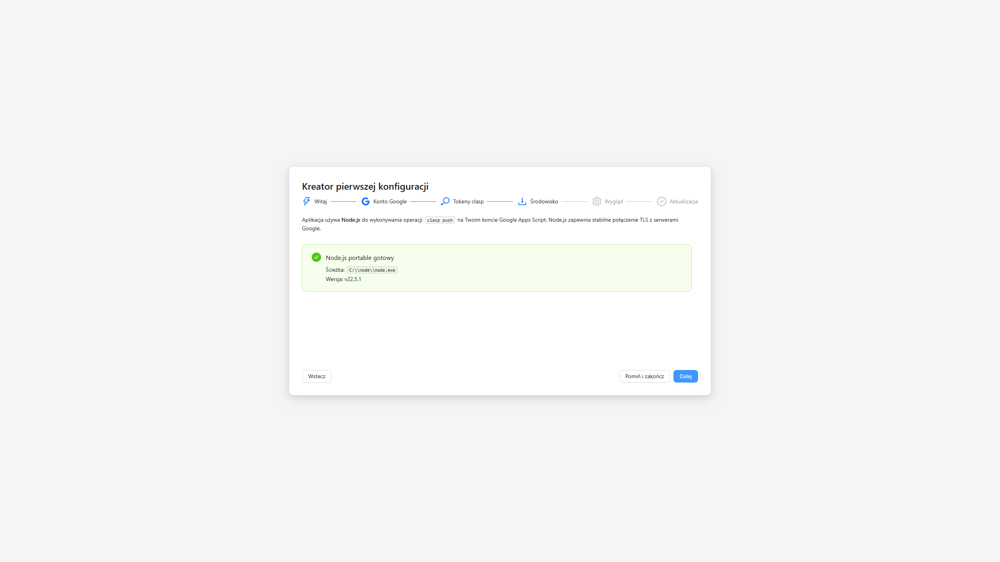

### 5. Wygląd

Wybierz jeden z trzech motywów: **Systemowy**, **Jasny** lub **Ciemny**.

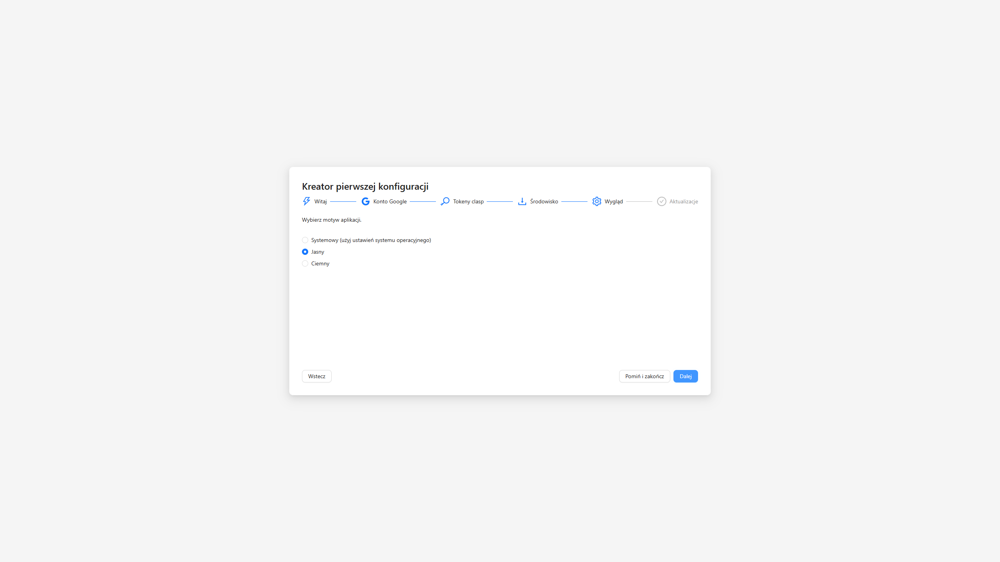

### 6. Aktualizacje

Włącz lub wyłącz:

- Automatyczne sprawdzanie aktualizacji aplikacji
- Automatyczne pobieranie plików GAS
- Automatyczne aktualizowanie wszystkich zarejestrowanych instalacji

Możesz także ustawić interwał sprawdzania nowych plików GAS (od 1 do 60 minut).

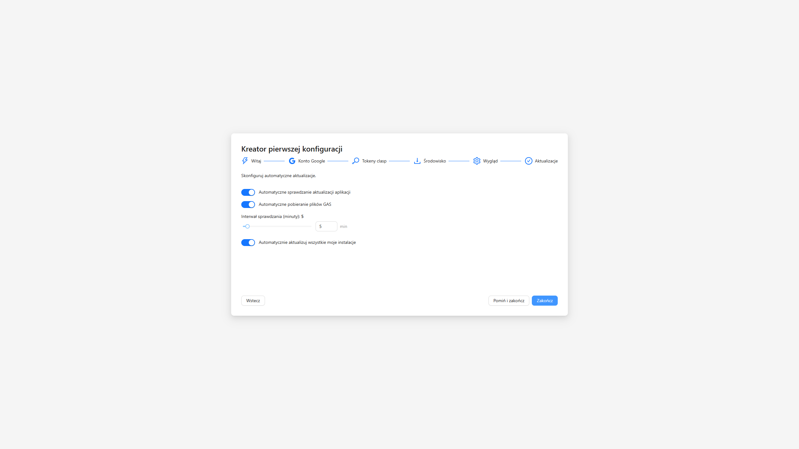

Po zakończeniu kliknij **Zakończ** lub **Pomiń i zakończ**, aby przejść do głównego okna. Każdy z pominiętych kroków można później powtórzyć w zakładce **Ustawienia** lub **O aplikacji → Kreator instalacji**.

---

## Główne okno aplikacji

Główne okno aplikacji składa się z trzech części:

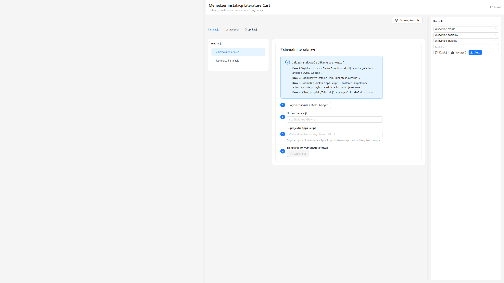

- **Lewy panel (40%)** — wbudowany widok przeglądarki Chromium, w którym logujesz się do Google i przeglądasz Google Sheets / Apps Script. Szerokość panelu można zmieniać za pomocą uchwytu podziału.
- **Prawy panel (60%)** — panel sterowania z zakładkami i podstronami.
- **Konsola** (opcjonalna, po prawej) — wyświetla logi z operacji, błędy i informacje diagnostyczne. Można ją otworzyć / zamknąć przyciskiem **Otwórz konsolę** / **Zamknij konsolę**.

W górnej części prawego panelu znajdują się trzy zakładki:

- **Instalacje** — instalowanie i zarządzanie skryptami GAS.
- **Ustawienia** — konfiguracja konta, motywu, aktualizacji i innych opcji.
- **O aplikacji** — informacje o wersji, dziennik zmian, kod źródłowy i kreator.

Każda zakładka ma własny pasek boczny z podstronami.

---

## Instalacja Apps Script w arkuszu

Aby zainstalować skrypt GAS w nowym arkuszu Google:

1. Przejdź do zakładki **Instalacje** → **Zainstaluj w arkuszu**.

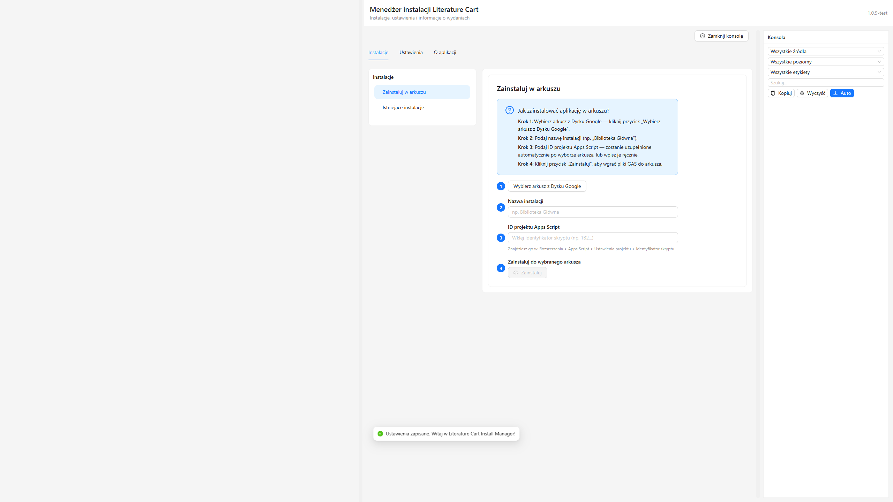

2. Kliknij **Wybierz arkusz z Dysku Google**. Otworzy się okno wyboru pliku z Dysku Google.

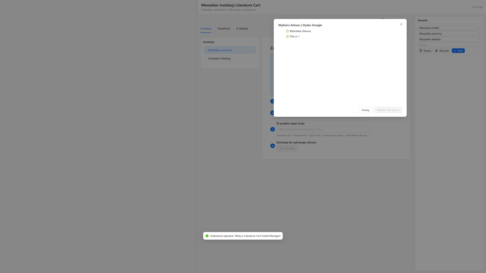

3. Znajdź i wybierz arkusz, do którego chcesz zainstalować skrypt, a następnie kliknij **Wybierz ten arkusz**. Aplikacja spróbuje automatycznie pobrać ID projektu Apps Script powiązanego z arkuszem.
4. W polu **Nazwa instalacji** wpisz czytelną nazwę, np. `Biblioteka Główna`.
5. Sprawdź lub uzupełnij pole **ID projektu Apps Script**. Identyfikator znajdziesz w: `Rozszerzenia → Apps Script → Ustawienia projektu → Identyfikator skryptu`.
6. Kliknij **Zainstaluj**. Aplikacja wykona `clasp push`, wypychając najnowsze pliki GAS do wskazanego projektu Apps Script.
7. Po pomyślnej instalacji pojawi się zielony komunikat **Zainstalowano pomyślnie**, a nowa pozycja zostanie zapisana w liście instalacji.

> **Wskazówka:** jeśli masz już istniejący projekt Apps Script powiązany z arkuszem, zaleca się wypchnięcie do niego kodu, aby nie tworzyć dodatkowych projektów.

---

## Zarządzanie istniejącymi instalacjami

Przejdź do zakładki **Instalacje** → **Istniejące instalacje**, aby zobaczyć listę wszystkich zarejestrowanych arkuszy.

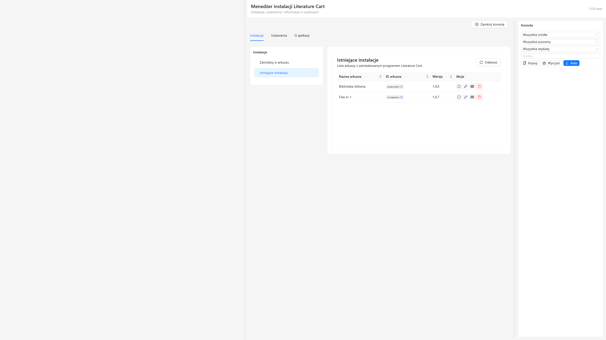

Tabela zawiera następujące kolumny:

- **Nazwa arkusza** — nazwa nadana podczas instalacji.
- **ID arkusza** — identyfikator arkusza Google (można go skopiować).
- **Wersja** — ostatnio zainstalowana wersja plików GAS.
- **Akcje**:
  - **Zainstaluj ponownie** — ponownie wypycha aktualne pliki GAS do tego arkusza.
  - **Otwórz Projekt Apps Script** — otwiera projekt skryptu w lewym panelu przeglądarki.
  - **Otwórz Arkusz** — otwiera arkusz Google w lewym panelu.
  - **Usuń instalację z listy** — otwiera okno deinstalacji.

### Usuwanie instalacji

Po kliknięciu ikony kosza przy wybranej instalacji pojawia się okno **Danger Zone: Usuwanie instalacji** z dwiema opcjami:

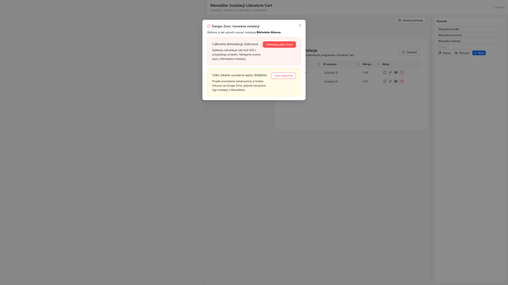

- **Odinstaluj pliki i Usuń** (zalecane) — aplikacja wypycha pusty projekt Apps Script, usuwając kod z arkusza, a następnie usuwa wpis z menedżera.
- **Tylko zapomnij** (miękkie) — usuwa tylko wpis z menedżera; kod w arkuszu pozostaje nienaruszony.

---

## Ustawienia

Zakładka **Ustawienia** dzieli się na cztery kategorie.

### Wygląd

Podstrona **Motyw** pozwala przełączać się między trzema motywami: **Jasny**, **Ciemny** i **Systemowy**. Wybór zapisuje się natychmiast.

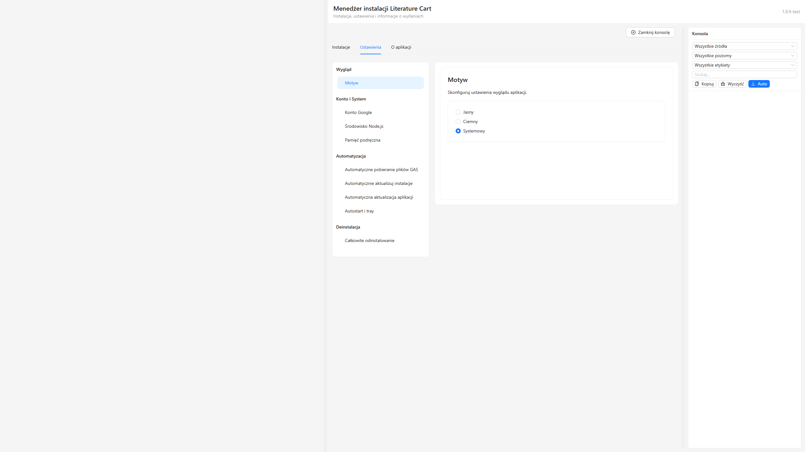

### Konto i System

#### Konto Google

Podstrona wyświetla stan zalogowania, adres e-mail i nazwę użytkownika. Umożliwia:

- ponowne zalogowanie lub zarządzanie kontem Google,
- twarde wylogowanie wszystkich modułów (usuwa ciasteczka sesji).

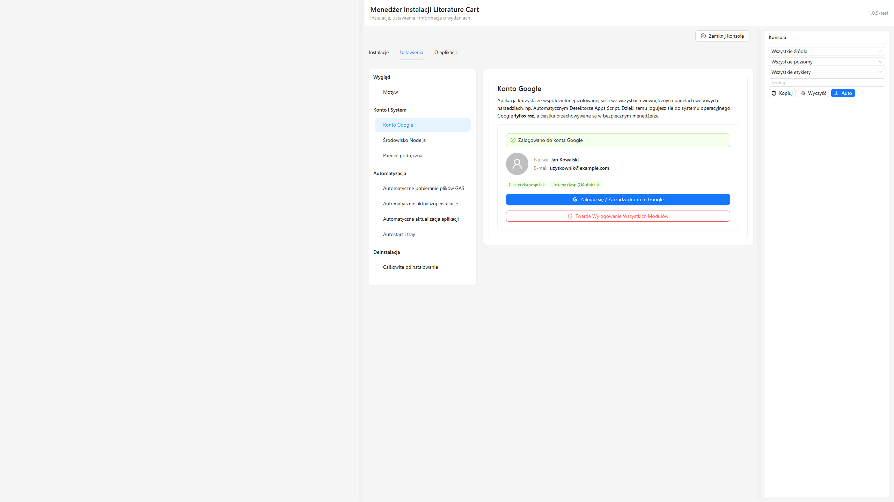

#### Środowisko Node.js

Wskazuje aktywne źródło Node.js (systemowe, portable lub wbudowane w Electrona). Jeśli dostępne są zarówno Node.js systemowy, jak i portable, możesz wybrać preferencję:

- **Automatyczna** — kolejność: systemowy → portable → wbudowany.
- **Wymuś portable** — kolejność: portable → systemowy → wbudowany.

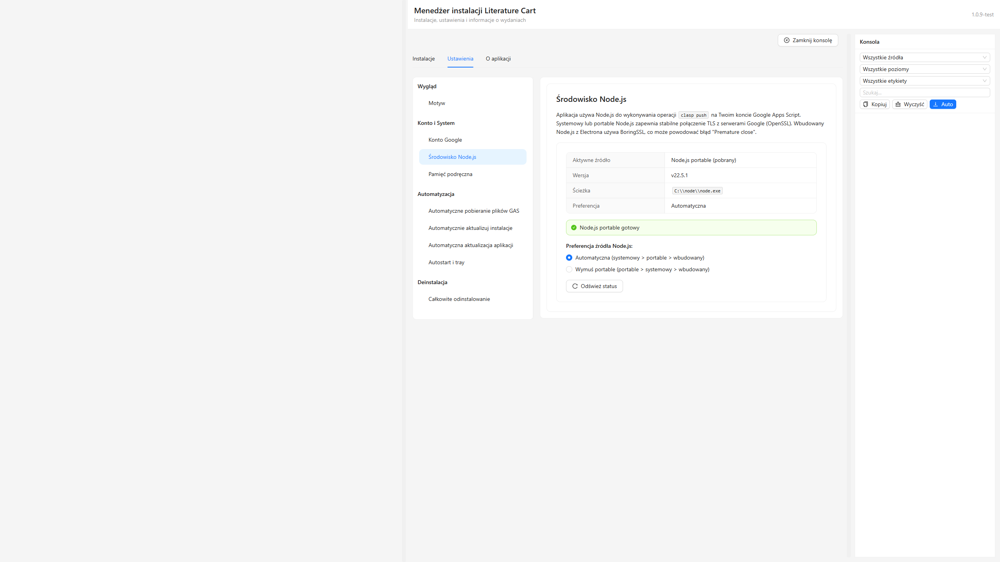

#### Pamięć podręczna

Wyświetla rozmiar głównego cache aplikacji oraz cache sesji Google. Kliknij **Wyczyść pamięć podręczną we wszystkich profilach**, jeśli napotkasz problemy z odświeżaniem interfejsu lub sesją.

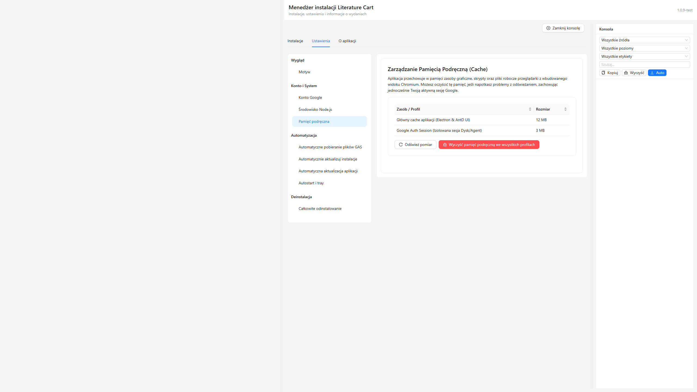

### Automatyzacja

#### Automatyczne pobieranie plików GAS

Włącz automatyczne sprawdzanie najnowszych plików GAS w repozytorium i ustaw interwał w minutach.

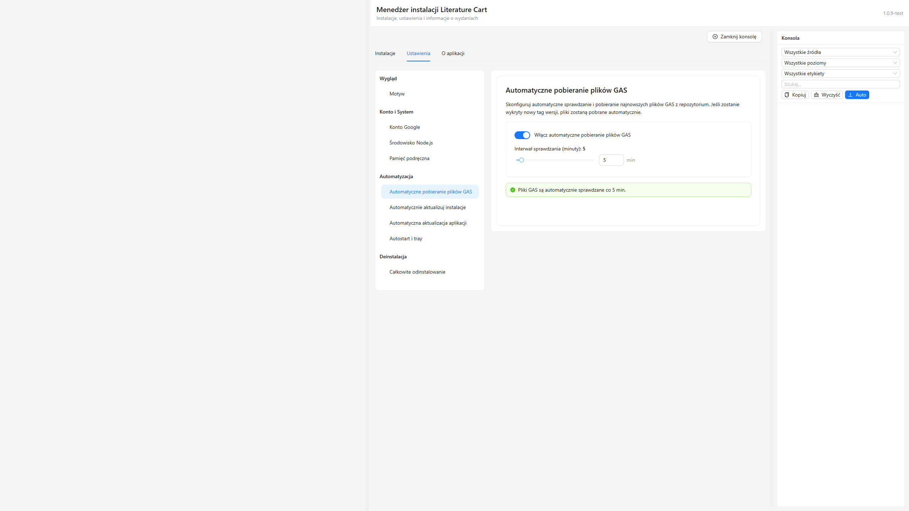

#### Automatycznie aktualizuj wszystkie moje instalacje

Gdy aplikacja pobierze nową wersję plików GAS, automatycznie wykona `clasp push` do wszystkich zarejestrowanych arkuszy. Opcja dostępna tylko przy włączonym automatycznym pobieraniu GAS.

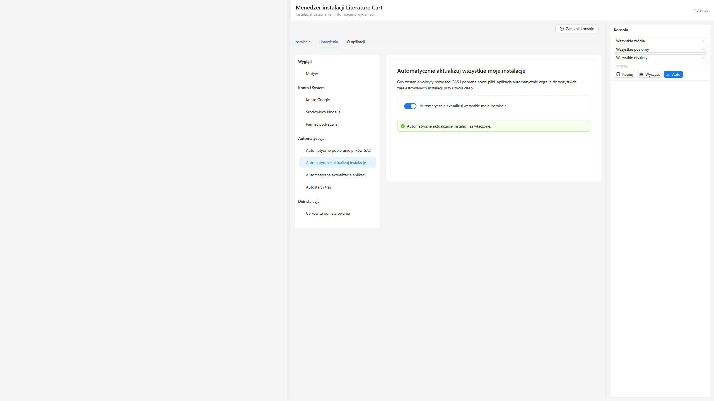

#### Automatyczna aktualizacja aplikacji

Włącz automatyczne sprawdzanie nowych wersji aplikacji desktopowej. Możesz wybrać kanał:

- **Stable** — stabilne wersje produkcyjne (`latest.txt`).
- **Test** — wersje testowe (`latest-test.txt`).

Kliknij **Sprawdź aktualizacje teraz**, aby ręcznie zweryfikować dostępność nowszej wersji.

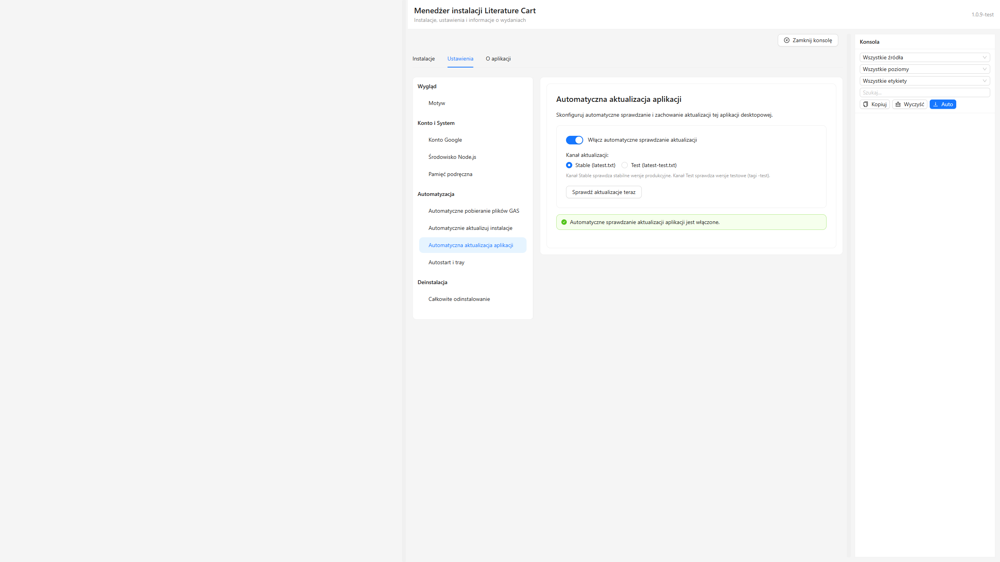

#### Autostart i tray

Zarządzaj uruchamianiem aplikacji wraz ze startem systemu oraz trybem **tray** (uruchamianie ukryte w zasobniku systemowym).

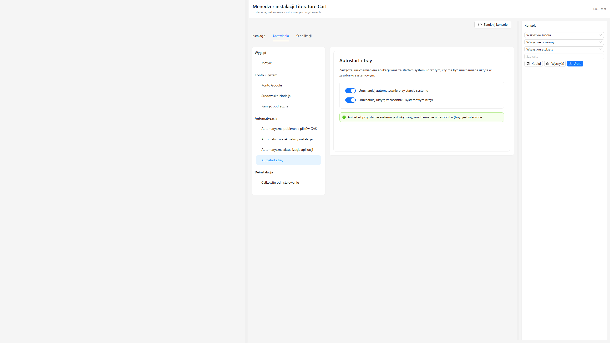

### Deinstalacja

#### Całkowite odinstalowanie

Podstrona umożliwia całkowite usunięcie aplikacji. Przed uruchomieniem możesz zaznaczyć opcje:

- Odinstaluj wszystkie instalacje GAS z arkuszy Google.
- Usuń wszystkie lokalne dane aplikacji (ustawienia, lista instalacji, tokeny, cache, autostart).
- Uruchom deinstalator systemowy i zamknij aplikację.

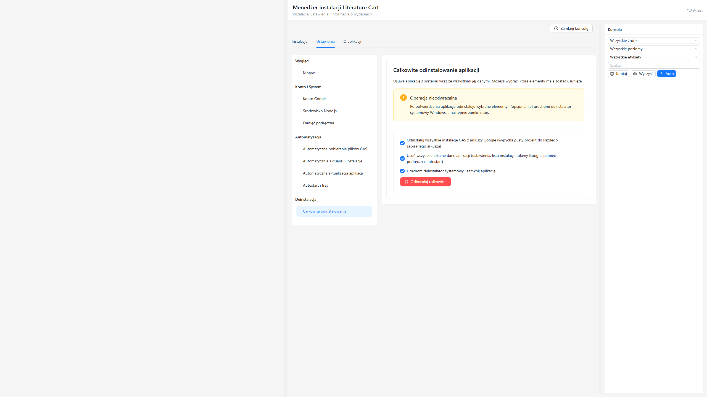

Po kliknięciu **Odinstaluj całkowicie** pojawi się okno potwierdzenia.

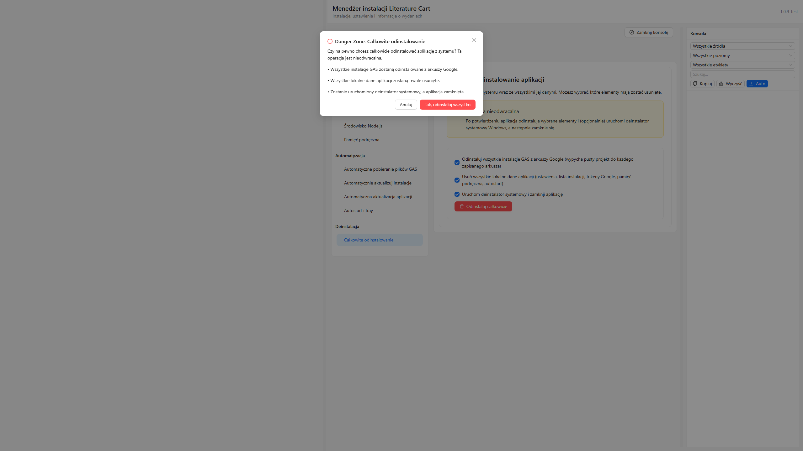

---

## O aplikacji

Zakładka **O aplikacji** zawiera cztery podstrony.

### Dziennik zmian

Wyświetla historię commitów repozytorium, ładowaną dynamicznie z pliku `changelog.json` wygenerowanego podczas budowania aplikacji.

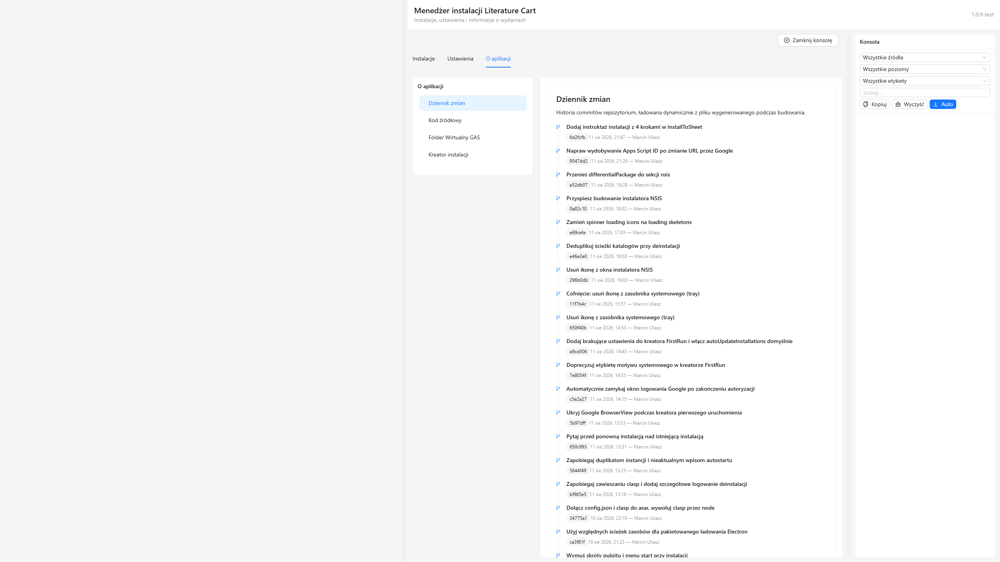

### Kod źródłowy

Zawiera link do publicznego repozytorium aplikacji na GitHub.

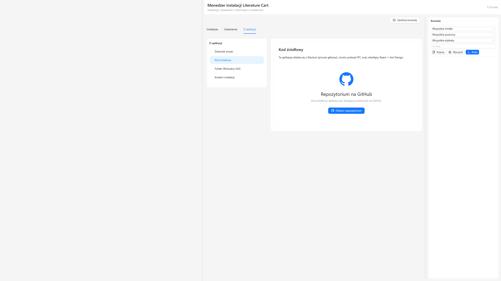

### Folder Wirtualny GAS

Pokazuje drzewo plików GAS przechowywanych w pamięci aplikacji. Kliknij **Załaduj pliki GAS**, aby pobrać najnowszą wersję ręcznie, lub wybierz plik z drzewa, aby zobaczyć jego zawartość.

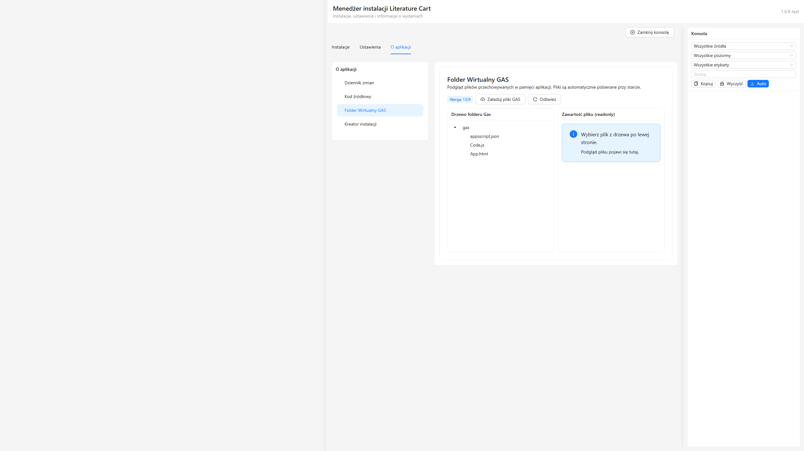

### Kreator instalacji

Pozwala uruchomić kreator pierwszej konfiguracji ponownie, np. po usunięciu pliku `app-settings.json` lub gdy chcesz zmienić podstawowe ustawienia.

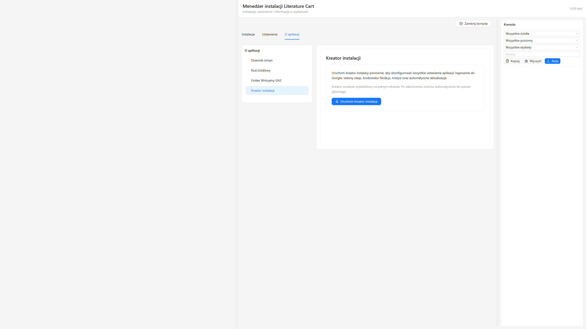

---

## Aktualizacja aplikacji

Gdy aplikacja wykryje nowszą wersję, wyświetli okno modalne **Dostępna aktualizacja aplikacji**.

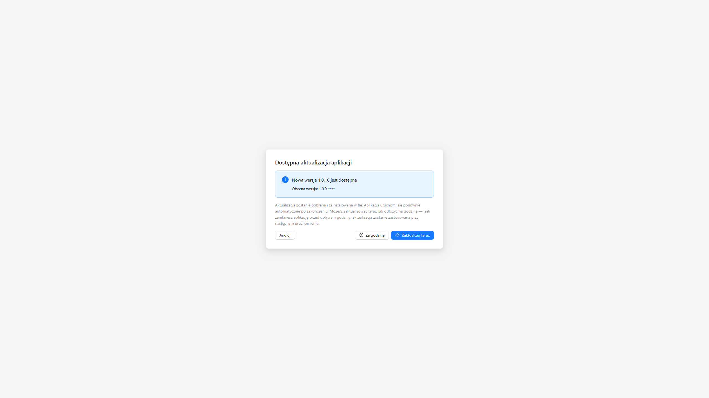

Masz trzy opcje:

- **Zaktualizuj teraz** — pobiera i instaluje nową wersję w tle, a następnie uruchamia aplikację ponownie.
- **Za godzinę** — planuje aktualizację za 60 minut. Jeśli zamkniesz aplikację wcześniej, aktualizacja zostanie zastosowana przy następnym uruchomieniu.
- **Anuluj** — zamyka okno; aplikacja ponownie sprawdzi dostępność aktualizacji później.

> **Uwaga:** proces pobierania i instalacji wyświetla się w osobnym oknie **Update in progress**. Po zakończeniu aplikacja uruchomi się ponownie automatycznie.

---

## Całkowite odinstalowanie

Aby całkowicie usunąć aplikację z systemu:

1. Przejdź do **Ustawienia** → **Całkowite odinstalowanie**.
2. Zaznacz odpowiednie opcje:
   - odinstalowanie skryptów GAS z arkuszy,
   - usunięcie lokalnych danych,
   - uruchomienie deinstalatora systemowego.
3. Kliknij **Odinstaluj całkowicie** i potwierdź w oknie dialogowym.

Aplikacja wykona wybrane operacje, uruchomi deinstalator systemowy (jeśli zaznaczono) i zamknie się. Możesz także odinstalować aplikację przez **Panel sterowania → Programy i funkcje** lub **Ustawienia Windows → Aplikacje**.

---

## Rozwiązywanie problemów

### Aplikacja nie może się zalogować do Google

- Sprawdź połączenie internetowe.
- Upewnij się, że w lewym panelu przeglądarki załadowała się strona logowania Google.
- Wyczyść pamięć podręczną w **Ustawienia → Pamięć podręczna** i spróbuj ponownie.

### Błąd „IPC bridge ... is not available"

Komunikat ten może pojawić się, gdy interfejs React jest uruchamiany poza procesem Electrona (np. w przeglądarce). W pełnej aplikacji desktopowej oznacza to problem z mostem `preload.js` — zrestartuj aplikację.

### Operacja `clasp push` kończy się błędem

- Upewnij się, że masz aktywne tokeny clasp (sekcja **Konto Google**).
- Sprawdź, czy Node.js jest poprawnie skonfigurowane (sekcja **Środowisko Node.js**).
- Upewnij się, że wybrany arkusz ma powiązany projekt Apps Script i podany jest poprawny `scriptId`.

### Aplikacja nie widzi nowszej wersji

- Sprawdź, czy opcja **Automatyczna aktualizacja aplikacji** jest włączona.
- Upewnij się, że ustawiony kanał aktualizacji (Stable / Test) odpowiada tagowi nowszej wersji.
- W sekcji **Automatyczna aktualizacja aplikacji** kliknij **Sprawdź aktualizacje teraz**.

### Nie mogę znaleźć okna aplikacji po minimalizacji

Jeśli włączono opcję **Uruchamiaj ukrytą w zasobniku systemowym (tray)**, aplikacja działa w tle. Kliknij ikonę w zasobniku systemowym (obok zegara), aby przywrócić okno.

---

*Dokumentacja została przygotowana dla wersji `1.0.9-test` aplikacji Literature Cart Install Manager.*
